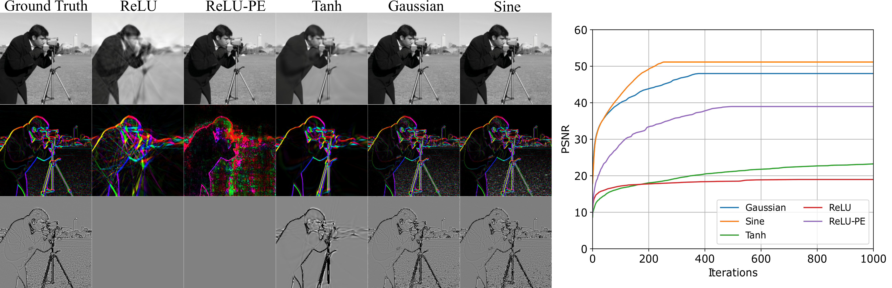

# Curvature-Aware Training for Coordinate Networks
### [Paper](https://arxiv.org/abs/2305.08552)
 

[Shin-Fang Chng](https://sfchng.github.io)\*1,
[Hemanth Saratchandran]()\*1,
[Sameera Ramasinghe]()2,
[Lachlan MacDonald]()1,
[Simon Lucey]()1,
1Australian Institute for Machine Learning (AIML), University of Adelaide, 2Amazon 
*denotes equal contribution

## Abstract

Coordinate networks are widely used in computer vision due to their ability to represent signals as compressed, continuous entities. However, training these networks with first-order optimizers can be slow, hindering their use in real-time applications. Recent works have opted for shallow voxel-based representations to achieve faster training, but this sacrifices memory efficiency. This work proposes a solution that leverages second-order optimization methods to significantly reduce training times for coordinate networks while maintaining their compressibility. Experiments demonstrate the effectiveness of this approach on various signal modalities, such as audio, images, videos, shape and neural radiance fields (NeRF).

## Code
We provide a [demo IPython notebook](https://colab.research.google.com/drive/1PYSs4UCOVHn2A5qze61WzgGTY9uuwMsT?authuser=2#scrollTo=Jozp8Gv2HWuy) as a simple reference for the core idea. 

## TODOs
- [x] provide demo
- [ ] python scripts for other modalities
- [ ] hessian analysis

